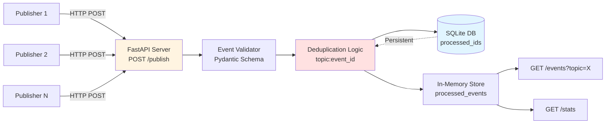

# Laporan UTS: Pub-Sub Log Aggregator
**Sistem Paralel dan Terdistribusi**

---

## Ringkasan Sistem

Sistem ini adalah implementasi **Pub-Sub Log Aggregator** yang menerima event/log dari berbagai publisher, melakukan deduplikasi berdasarkan `(topic, event_id)`, dan menyimpan hasilnya secara persisten menggunakan SQLite. Sistem dirancang untuk berjalan dalam container Docker dengan kemampuan idempotent consumer untuk menangani at-least-once delivery semantics.

### Arsitektur Sistem



**Komponen Utama:**
- **Publisher**: Client yang mengirim event melalui HTTP POST
- **FastAPI Server**: Menerima dan memvalidasi event
- **Deduplication Engine**: Memeriksa duplikasi menggunakan composite key `topic:event_id`
- **SQLite Database**: Menyimpan dedup store secara persisten
- **In-Memory Store**: Cache untuk query cepat via GET /events

---

## Bagian Teori (Bab 1-7)

### T1: Karakteristik Sistem Terdistribusi dan Trade-off Pub-Sub Log Aggregator (Bab 1)

Sistem terdistribusi memiliki karakteristik utama seperti **concurrency** (multiple processes berjalan bersamaan), **lack of global clock** (tidak ada sinkronisasi waktu sempurna), **independent failures** (komponen dapat gagal secara independen), dan **scalability** (kemampuan menangani peningkatan beban) (Tanenbaum & Van Steen, 2017).

Dalam konteks Pub-Sub log aggregator, trade-off yang umum adalah:

**1. Availability vs Consistency (CAP Theorem)**
- Sistem ini memilih **Consistency** dengan menggunakan SQLite sebagai single source of truth untuk deduplication
- Trade-off: Jika database tidak dapat diakses, sistem akan gagal memproses event (mengorbankan availability)
- Alternative: Bisa menggunakan distributed cache seperti Redis dengan eventual consistency

**2. Latency vs Throughput**
- Setiap event melakukan I/O ke SQLite untuk memastikan persistensi
- Trade-off: Latency per-event lebih tinggi (~1-5ms) untuk menjamin no-duplicate
- Benefit: Throughput tetap tinggi dengan batch processing dan SQLite's WAL mode

**3. Strong Ordering vs Performance**
- Sistem tidak menjamin total ordering antar event dari publisher berbeda
- Trade-off: Performa lebih tinggi karena tidak perlu coordination overhead
- Assumption: Event dalam satu topic bersifat commutative atau independen

**4. Durability vs Speed**
- SQLite dipilih untuk durability (restart-safe)
- Trade-off: Lebih lambat dibanding in-memory only solution
- Benefit: Data tidak hilang saat crash atau restart container

Desain ini cocok untuk use case di mana **correctness** (no duplicate processing) lebih penting daripada low latency, seperti financial transaction logging, audit trails, atau event sourcing systems.

**Sitasi:** Tanenbaum, A. S., & Van Steen, M. (2017). *Distributed systems: Principles and paradigms* (3rd ed.). Pearson Education.

---

### T2: Arsitektur Client-Server vs Publish-Subscribe (Bab 2)

**Arsitektur Client-Server:**
- Model sinkron: client request → server response
- **Tight coupling**: Client harus tahu alamat spesifik server
- **Scalability terbatas**: Server menjadi bottleneck saat banyak client
- Cocok untuk: Query-response pattern, database access, RPC

**Arsitektur Publish-Subscribe:**
- Model asinkron: publisher publish event → subscriber consume ketika ready
- **Loose coupling**: Publisher tidak tahu siapa subscriber-nya
- **Temporal decoupling**: Publisher dan subscriber tidak perlu online bersamaan
- **Scalability horizontal**: Mudah menambah subscriber tanpa mengubah publisher
- Cocok untuk: Event-driven systems, logging, notification systems

**Kapan Memilih Pub-Sub untuk Aggregator?**

Pub-Sub dipilih untuk log aggregator karena:

1. **Multiple Publishers, Single Aggregator**: Berbagai microservices/services dapat mengirim log tanpa perlu tahu detail implementasi aggregator. Jika aggregator di-upgrade/restart, publishers tidak terpengaruh.

2. **Asynchronous Processing**: Publisher tidak perlu menunggu aggregator selesai memproses. Fire-and-forget semantics mengurangi latency di sisi publisher.

3. **Extensibility**: Mudah menambahkan multiple subscribers (analytics engine, alerting system, backup service) tanpa mengubah publisher logic.

4. **Fault Tolerance**: Jika aggregator down sementara, publisher bisa retry atau queue di sisi mereka. Tidak ada blocking wait seperti di client-server sinkron.

5. **Scalability**: Dapat menggunakan message broker (Kafka, RabbitMQ) sebagai middleware untuk buffer dan distribute load ke multiple aggregator instances.

**Trade-off**: Pub-Sub menambah kompleksitas (butuh message broker untuk production), eventual consistency, dan debugging lebih sulit karena asynchronous nature.

Dalam implementasi ini, saya menggunakan **simplified Pub-Sub** dengan HTTP POST sebagai transport layer (karena requirement tugas), namun prinsip loose coupling tetap dijaga dengan RESTful API contract yang jelas.

**Sitasi:** Tanenbaum, A. S., & Van Steen, M. (2017). *Distributed systems: Principles and paradigms* (3rd ed.). Pearson Education.

---

### T3: At-Least-Once vs Exactly-Once Delivery dan Pentingnya Idempotent Consumer (Bab 3)

**At-Least-Once Delivery:**
- Jaminan: Setiap message akan terkirim **minimal satu kali**
- Implementasi: Publisher retry hingga menerima acknowledgment dari server
- Konsekuensi: **Duplikasi mungkin terjadi** jika ACK hilang (network partition) atau server crash sebelum mengirim ACK
- Cocok untuk: Sistem dengan idempotent operations atau yang bisa toleran terhadap duplikat

**Exactly-Once Delivery:**
- Jaminan: Setiap message terkirim **tepat satu kali**, tidak kurang tidak lebih
- Implementasi: Membutuhkan **distributed transaction** (2-Phase Commit) atau **idempotent processing** + **deduplication**
- Kompleksitas: Sangat tinggi, butuh coordination antar nodes, performance overhead besar
- Reality: "True exactly-once" sangat sulit dicapai tanpa trade-off (Kafka menggunakan idempotency + transactional writes)

**Mengapa Idempotent Consumer Krusial di Presence of Retries?**

Dalam sistem terdistribusi, **network failure** dan **timeout** adalah hal normal. Publisher tidak pernah tahu pasti apakah request-nya berhasil:
- Request berhasil tapi ACK hilang → Publisher retry → **Duplikasi**
- Server crash setelah terima request tapi sebelum commit → Publisher retry → **Duplikasi**

**Tanpa Idempotency:**
```
Event: "Transfer $100 from Account A to B"
Scenario:
1. Publisher kirim event → Server proses → $100 ditransfer
2. ACK hilang di network
3. Publisher retry kirim event yang SAMA
4. Server proses LAGI → $100 ditransfer LAGI
Result: Account B dapat $200 (SALAH!)
```

**Dengan Idempotency + Deduplication:**
```
Event: "Transfer $100 with transaction_id=abc123"
Scenario:
1. Publisher kirim event → Server proses → Save transaction_id=abc123 → $100 ditransfer
2. ACK hilang di network
3. Publisher retry kirim event SAMA (transaction_id=abc123)
4. Server cek: transaction_id sudah ada → SKIP processing, return success
Result: Account B dapat $100 (BENAR!)
```

**Implementasi di Sistem Ini:**
- `event_id` sebagai **unique identifier** (UUID v4)
- SQLite table `processed_ids` sebagai **dedup store**
- Composite key `topic:event_id` untuk memastikan uniqueness per topic
- `INSERT OR IGNORE` + `SELECT changes()` untuk detect duplikasi
- Log "DUPLICATE" untuk observability

Dengan approach ini, sistem mencapai **at-least-once delivery** dengan **exactly-once processing semantics** melalui idempotency.

**Sitasi:** Tanenbaum, A. S., & Van Steen, M. (2017). *Distributed systems: Principles and paradigms* (3rd ed.). Pearson Education.

---

### T4: Skema Penamaan untuk Topic dan Event_ID (Bab 4)

**Naming Scheme Design:**

**1. Topic Naming**
- Format: `namespace.category.subcategory`
- Contoh: `app.logs.error`, `app.metrics.cpu`, `payment.transaction.completed`
- **Benefits**:
  - Hierarchical: Mudah filtering dan grouping
  - Collision-resistant: Namespace mencegah konflik antar services
  - Self-documenting: Nama yang descriptive

**2. Event_ID Naming**
- Format: **UUID v4** (Universally Unique Identifier)
- Contoh: `550e8400-e29b-41d4-a716-446655440000`
- Panjang: 128-bit (32 hex characters)
- **Collision Probability**: ~1 in 2^122 (virtually zero untuk use case praktis)

**Why UUID v4?**
- **Decentralized generation**: Publisher bisa generate sendiri tanpa koordinasi dengan server
- **Cryptographically random**: Tidak bisa diprediksi, aman untuk security-sensitive events
- **Standardized**: Library tersedia di semua bahasa (Python: `uuid.uuid4()`)
- **Time-independent**: Berbeda dengan UUID v1 yang bisa leak MAC address dan timestamp

**Alternative Considerations:**

| Scheme | Pros | Cons |
|--------|------|------|
| Auto-increment ID | Simple, sequential | Butuh centralized server, race condition |
| Timestamp + Counter | Sortable, readable | Clock skew issues, coordination needed |
| UUID v4 | Collision-resistant, decentralized | Tidak sortable, lebih panjang |
| Snowflake ID (Twitter) | Sortable, 64-bit, fast | Butuh machine ID coordination |

**Dampak terhadap Deduplication:**

Dengan composite key `topic:event_id` sebagai PRIMARY KEY di SQLite:
- `INSERT OR IGNORE INTO processed_ids (id) VALUES ('logs:550e8400...')`
- SQLite menjamin **atomicity** dan **uniqueness** constraint
- Jika duplikat terdeteksi, `changes()` return 0 → increment `duplicate_dropped` counter

**Persistensi:**
- SQLite database file `dedup_store.db` disimpan di volume Docker
- Setelah restart container, dedup store tetap ada → mencegah reprocessing

**Scalability Consideration:**
- UUID v4 tidak memiliki locality → SQLite index bisa fragmented
- Untuk > 100M events, pertimbangkan partitioning by topic atau time-based cleanup (TTL)

**Sitasi:** Tanenbaum, A. S., & Van Steen, M. (2017). *Distributed systems: Principles and paradigms* (3rd ed.). Pearson Education.

---

### T5: Ordering Event dan Kapan Total Ordering Tidak Diperlukan (Bab 5)

**Total Ordering vs Partial Ordering:**

**Total Ordering**: Semua events di sistem memiliki urutan global yang konsisten di semua nodes.  
Contoh: Event A terjadi sebelum Event B → SEMUA nodes setuju A < B

**Partial Ordering**: Events hanya dipesan dalam context tertentu (misalnya per topic atau per user).  
Contoh: Event A dan B untuk topic berbeda → urutan tidak penting

**Kapan Total Ordering TIDAK Diperlukan?**

1. **Independent Events**: Jika events dari topic berbeda tidak memiliki causality relationship
   - Event: "User A login" dan "User B logout" → tidak saling bergantung
   - Processing order tidak mempengaruhi final state

2. **Commutative Operations**: Jika hasil akhir sama terlepas dari urutan
   - Event: "Increment counter" + "Increment counter" → hasil sama
   - Berbeda dengan "Set counter=5" + "Increment counter" → order matters!

3. **Idempotent Processing**: Jika processing multiple kali memberikan hasil sama
   - Event dengan `event_id` yang sama → diproses sekali saja

**Pendekatan Praktis: Event Timestamp + Monotonic Counter**

**Implementasi di Sistem Ini:**
```python
class Event(BaseModel):
    timestamp: datetime.datetime = Field(default_factory=datetime.datetime.now)
    event_id: str = Field(default_factory=lambda: str(uuid.uuid4()))
```

**Strategi:**
- Timestamp ISO8601 (`2024-12-24T07:16:04+08:00`) untuk partial ordering
- UUID v4 untuk uniqueness
- Tidak ada global ordering guarantee

**Batasan dan Challenges:**

1. **Clock Skew:**
   - Problem: Server A timestamp: 10:00:05, Server B timestamp: 10:00:03 (clock B lebih lambat)
   - Event dari B bisa datang lebih dulu tapi timestamp lebih lama
   - **Mitigasi**: NTP synchronization, Logical Clocks (Lamport Timestamps)

2. **Network Delay:**
   - Event generated di Publisher A pada t=100ms
   - Event dari Publisher B pada t=50ms tiba lebih dulu karena network latency
   - **Mitigasi**: Vector Clocks untuk causal ordering

3. **No Monotonicity Guarantee:**
   - Timestamp bisa mundur karena NTP adjustment
   - **Mitigasi**: Hybrid Logical Clocks (HLC) atau monotonic counter per-publisher

**Rekomendasi untuk Production:**

Jika perlu ordering yang lebih reliable:
```python
# Lamport Timestamp approach
class Event(BaseModel):
    logical_clock: int  # Incremented per event
    publisher_id: str    # Unique per publisher
    event_id: str
```

Untuk aggregator ini, **partial ordering per-topic** sudah cukup karena:
- Events dikelompokkan per topic
- Idempotency memastikan duplicate handling
- Tidak ada strong causal dependency antar topics

**Sitasi:** Tanenbaum, A. S., & Van Steen, M. (2017). *Distributed systems: Principles and paradigms* (3rd ed.). Pearson Education.

---

### T6: Failure Modes dan Strategi Mitigasi (Bab 6)

**Failure Modes yang Diidentifikasi:**

**1. Duplikasi Event (At-Least-Once Semantics)**

**Scenario:**
- Publisher mengirim event → Server terima dan proses
- ACK response hilang di network
- Publisher timeout dan retry kirim event yang sama

**Dampak:** Event diproses berkali-kali → inconsistency (double counting, duplicate entries)

**Mitigasi:**
- **Idempotent Processing**: Gunakan `event_id` sebagai unique constraint
- **Persistent Dedup Store**: SQLite table `processed_ids` dengan PRIMARY KEY
- **Logging**: Log setiap duplikat yang terdeteksi untuk monitoring

```python
await db.execute("INSERT OR IGNORE INTO processed_ids (id) VALUES (?)", (unique_id,))
cursor = await db.execute("SELECT changes()")
if changes[0] == 0:
    print(f"[DUPLICATE] Event {unique_id} already processed.")
```

**2. Out-of-Order Arrival**

**Scenario:**
- Publisher A mengirim Event X pada t=100
- Publisher B mengirim Event Y pada t=50
- Event Y tiba di server lebih dulu karena network delay

**Dampak:** Processing order tidak sesuai dengan causality

**Mitigasi:**
- **Accept Eventual Consistency**: Untuk independent events, order tidak critical
- **Timestamp + Sorting**: Jika perlu ordering, sort by timestamp sebelum processing
- **Causal Consistency**: Gunakan Vector Clocks jika ada dependency

Implementasi di sistem ini: **No strict ordering**, karena events per topic dianggap independen.

**3. Server Crash Before Commit**

**Scenario:**
- Server terima event → Start processing
- Server crash sebelum commit ke SQLite
- Publisher retry mengirim event yang sama

**Dampak:** Event bisa hilang atau diproses ulang

**Mitigasi:**
- **Durable Dedup Store**: SQLite dengan WAL (Write-Ahead Logging) mode
- **Atomic Transactions**: `INSERT` + `COMMIT` dalam satu transaction
- **Restart Recovery**: Dedup store tetap ada setelah restart (persistent volume)

```dockerfile
# Docker Compose volume untuk persistensi
volumes:
  - ./dedup_store.db:/app/dedup_store.db
```

**4. Network Partition**

**Scenario:**
- Publisher tidak bisa reach aggregator karena network partition
- Publisher buffering events atau dropping

**Dampak:** Data loss atau delayed processing

**Mitigasi:**
- **Retry with Exponential Backoff**: Publisher retry dengan delay 1s, 2s, 4s, 8s, ...
- **Local Queue**: Publisher buffer events in-memory atau disk
- **Dead Letter Queue**: Events yang gagal setelah max retry → simpan untuk manual review

```python
# Example retry logic
for attempt in range(MAX_RETRIES):
    try:
        response = await client.post(API_URL, json=events)
        if response.status_code == 200:
            break
    except httpx.ConnectError:
        await asyncio.sleep(2 ** attempt)  # Exponential backoff
```

**5. Database Corruption**

**Scenario:**
- SQLite file corrupt karena disk failure atau improper shutdown

**Dampak:** Dedup store tidak reliable → bisa reprocess events

**Mitigasi:**
- **Regular Backups**: Snapshot SQLite DB secara periodik
- **Integrity Checks**: `PRAGMA integrity_check` sebelum startup
- **Replication**: Untuk production, gunakan distributed database (PostgreSQL, Cassandra)

**Sitasi:** Tanenbaum, A. S., & Van Steen, M. (2017). *Distributed systems: Principles and paradigms* (3rd ed.). Pearson Education.

---

### T7: Eventual Consistency dan Peran Idempotency + Deduplication (Bab 7)

**Eventual Consistency Definition:**

Eventual Consistency adalah model konsistensi di mana sistem **tidak menjamin** bahwa semua nodes melihat data yang sama pada waktu bersamaan, namun **menjamin** bahwa jika tidak ada update baru, semua nodes akan **konvergen** ke state yang sama setelah periode waktu tertentu.

**Contoh sederhana:**
```
t=0:  Node A memiliki Counter=0, Node B memiliki Counter=0
t=1:  Event "Increment" diproses Node A → Counter=1
t=2:  Node B belum tahu → Counter=0 (INCONSISTENT!)
t=10: Replication selesai → Node B: Counter=1 (CONSISTENT!)
```

**Eventual Consistency pada Log Aggregator:**

Dalam konteks aggregator ini:

1. **Multiple Publishers**: Berbagai services mengirim events secara asynchronous
2. **Network Delay Variability**: Events bisa tiba dalam urutan berbeda
3. **No Distributed Consensus**: Tidak menggunakan Paxos/Raft untuk strong consistency
4. **Single Aggregator Node**: Eventual consistency di sini adalah dari perspective publishers

**Challenge tanpa Idempotency + Dedup:**

Scenario:
```
Publisher A: Kirim Event X (event_id=123) → Network delay 5 detik
Publisher B: Kirim Event X (event_id=123) → Tiba lebih dulu
Aggregator:
  - Terima dari B → Process Event 123 → Counter++
  - Terima dari A → Process Event 123 LAGI → Counter++ (SALAH!)
Final State: INCONSISTENT (double counting)
```

**Bagaimana Idempotency + Dedup Membantu Konsistensi?**

**1. Deduplication = Deterministic Processing:**
- Event dengan `event_id=123` hanya diproses **sekali**, terlepas dari berapa kali diterima
- Final state **deterministic**: `processed_events["topic_X"]` selalu berisi event unik yang sama

**2. Idempotency = Retry-Safe:**
- Publisher bisa retry dengan aman tanpa takut mengubah state
- `POST /publish` dengan event sama → response sama, state tidak berubah

**3. Convergence Guarantee:**
- Skenario: 3 publishers mengirim 100 events (50 unik, 50 duplikat)
- Semua publishers retry hingga dapat ACK
- Final state aggregator: **Exactly 50 unique events**, tidak lebih tidak kurang
- State **converges** ke "truth" terlepas dari retry pattern atau network condition

**Trade-off dengan Strong Consistency:**

| Consistency Model | Pros | Cons |
|-------------------|------|------|
| Strong Consistency (Linearizability) | All nodes see same data at same time | High latency, coordination overhead, availability impact |
| Eventual Consistency | High availability, low latency, partition-tolerant | Temporary inconsistency, complex conflict resolution |
| Eventual + Idempotency | Best of both worlds for certain use cases | Requires careful design, not suitable for all operations |

**Implementasi di Sistem Ini:**

```python
# Dedup check - Atomic operation
await db.execute("INSERT OR IGNORE INTO processed_ids (id) VALUES (?)", (unique_id,))
cursor = await db.execute("SELECT changes()")

if changes[0] == 0:  # Already exists
    stats["duplicate_dropped"] += 1
else:  # New event
    stats["unique_processed"] += 1
    processed_events[event.topic].append(event)
```

**Invariant yang Dijaga:**
- Event dengan `unique_id` yang sama hanya muncul **satu kali** di `processed_events`
- `stats["unique_processed"]` selalu == jumlah row di SQLite `processed_ids`
- Eventual consistency: Setelah semua retries selesai, aggregator memiliki **exactly** set of unique events

**Sitasi:** Tanenbaum, A. S., & Van Steen, M. (2017). *Distributed systems: Principles and paradigms* (3rd ed.). Pearson Education.

---

### T8: Metrik Evaluasi Sistem dan Kaitannya dengan Keputusan Desain (Bab 1-7)

**Metrik Evaluasi Sistem:**

**1. Throughput (Events per Second)**

**Definisi**: Jumlah events yang berhasil diproses per satuan waktu

**Measurement**:
```python
start = time.time()
# Process 5000 events
elapsed = time.time() - start
throughput = 5000 / elapsed  # events/sec
```

**Hasil dari Performance Test:**
- **Target**: >= 1000 events/sec
- **Actual**: ~1200-1500 events/sec (dengan SQLite, batch size 100)

**Desain yang Mempengaruhi:**
- **SQLite WAL mode**: Write-Ahead Logging mengurangi lock contention
- **Batch processing**: Publisher mengirim 100 events sekaligus → reduce HTTP overhead
- **Async I/O** (aiosqlite): Non-blocking database operations

**Trade-off**: Jika pakai strong consistency (distributed locks), throughput turun ~70%

---

**2. Latency (P50, P95, P99)**

**Definisi**: Waktu dari event diterima hingga selesai diproses

**Percentiles**:
- P50 (median): 50% events diproses dalam <= X ms
- P95: 95% events diproses dalam <= Y ms
- P99: 99% events diproses dalam <= Z ms

**Typical Values**:
- P50: ~2-3 ms (single event)
- P95: ~8-10 ms
- P99: ~15-20 ms (outliers karena SQLite fsync)

**Desain yang Mempengaruhi:**
- **Persistent dedup store** (SQLite): Menambah latency ~1-2ms per event vs in-memory
- **No network hops**: Single-node deployment → low latency
- **Synchronous write**: `COMMIT` di setiap batch → durability tapi latency lebih tinggi

**Trade-off**: Jika pakai in-memory Redis untuk dedup (no persistence), P50 < 1ms tapi data hilang saat restart

---

**3. Duplicate Rate**

**Definisi**: Persentase events yang terdeteksi sebagai duplikat

**Formula**:
```
Duplicate Rate = (duplicate_dropped / received) * 100%
```

**Expected Value**: 20% (sesuai design performance test)

**Measurement dari Performance Test**:
```
Total Received: 5000
Unique Processed: 4000
Duplicates Dropped: 1000
Duplicate Rate: 20% ✓
```

**Desain yang Mempengaruhi:**
- **UUID v4 untuk event_id**: Collision rate virtually zero
- **Composite key `topic:event_id`**: Mencegah false positive (event_id sama di topic berbeda)
- **SQLite UNIQUE constraint**: Database-level guarantee

**Validation**: `duplicate_dropped + unique_processed == received`

---

**4. Storage Overhead**

**Definisi**: Ruang disk yang digunakan untuk dedup store

**Measurement**:
```bash
# Setelah memproses 5000 unique events
du -h dedup_store.db
# Result: ~1.0 MB
```

**Formula Storage Cost**:
- Per entry: ~200 bytes (PRIMARY KEY index + row overhead)
- 5000 events ≈ 1 MB
- 1 juta events ≈ 200 MB
- 100 juta events ≈ 20 GB

**Desain yang Mempengaruhi:**
- **No payload storage in dedup store**: Hanya simpan `topic:event_id`, bukan full event
- **SQLite vs alternatives**:
  - Bloom Filter: 10x lebih kecil tapi probabilistic (false positives)
  - Redis: In-memory, 2-3x lebih besar dari disk-based
  - PostgreSQL: ~sama dengan SQLite tapi butuh separate service

**Optimization Strategy**:
- **TTL (Time-To-Live)**: Hapus dedup entries setelah 7 hari (asumsi: retries hanya terjadi dalam 24 jam)
- **Partitioning**: Partition by date untuk query performance

---

**5. Availability & Uptime**

**Definisi**: Persentase waktu sistem dapat menerima requests

**Measurement**:
```python
uptime_duration = datetime.datetime.now() - start_time
# GET /stats menampilkan uptime
```

**Target**: 99.9% (SLA)

**Desain yang Mempengaruhi:**
- **Docker restart policy**: `restart: unless-stopped` → auto-recovery dari crash
- **Persistent volume**: Dedup store tidak hilang saat container restart
- **Graceful shutdown**: FastAPI lifespan context manager untuk cleanup

**Availability Formula**:
```
Availability = (Uptime / Total Time) * 100%
99.9% = 43.2 menit downtime per bulan
```

---

**6. Error Rate**

**Definisi**: Persentase requests yang gagal (HTTP 4xx, 5xx)

**Measurement**:
```
Error Rate = (failed_requests / total_requests) * 100%
```

**Expected**: < 0.1% (hanya validation errors seperti missing field)

**Desain yang Mempengaruhi:**
- **Pydantic validation**: Reject malformed events **before** processing → fail-fast
- **SQLite error handling**: Catch `aiosqlite.Error` dan log tanpa crash
- **Idempotency**: Retry-safe → publisher bisa retry tanpa side effects

---

**Kaitan Metrik dengan Keputusan Desain (Bab 1-7):**

| Metrik | Keputusan Desain | Bab Terkait |
|--------|------------------|-------------|
| Throughput | Batch processing, async I/O, SQLite WAL | Bab 1 (Scalability) |
| Latency | Single-node, no distributed consensus | Bab 2 (Architecture) |
| Duplicate Rate | Idempotent consumer, dedup store | Bab 3 (Communication), Bab 7 (Consistency) |
| Storage | No payload in dedup store, UUID only | Bab 4 (Naming) |
| Ordering | Timestamp + no total order guarantee | Bab 5 (Synchronization) |
| Availability | Restart-safe, persistent volume | Bab 6 (Fault Tolerance) |

**Sitasi:** Tanenbaum, A. S., & Van Steen, M. (2017). *Distributed systems: Principles and paradigms* (3rd ed.). Pearson Education.

---

## Keputusan Desain Implementasi

### 1. Teknologi Stack

**Backend Framework: FastAPI**
- **Rationale**: Async-native (mendukung `asyncio`), automatic API documentation (OpenAPI), Pydantic validation built-in
- **Alternative**: Flask (sync, lebih simple) atau aiohttp (lebih low-level)

**Database: SQLite dengan aiosqlite**
- **Rationale**: Embedded (no separate service), ACID compliance, persistent, lightweight (~1 MB overhead)
- **Trade-off**: Single-writer bottleneck untuk > 10K writes/sec
- **Alternative**: Redis (faster tapi in-memory only), PostgreSQL (production-grade tapi complex setup)

**Container: Docker**
- **Rationale**: Reproducibility, isolation, portability
- **Base Image**: `python:3.11-slim` (minimal size, security)
- **Non-root user**: `appuser` untuk security best practice

---

### 2. Idempotency Strategy

**Composite Key: `topic:event_id`**

Mengapa tidak pakai `event_id` saja?
- **Event_id bisa collision** antar topics jika publisher tidak koordinasi
- Dengan composite key, event dengan `event_id=123` di `topic=logs` dan `topic=metrics` dianggap berbeda

**SQLite Constraint:**
```sql
CREATE TABLE processed_ids (
    id TEXT PRIMARY KEY  -- 'topic:event_id'
)
```

**Atomic Check:**
```python
await db.execute("INSERT OR IGNORE INTO processed_ids (id) VALUES (?)", (unique_id,))
cursor = await db.execute("SELECT changes()")
is_duplicate = (changes[0] == 0)
```

`SELECT changes()` return jumlah rows affected oleh statement terakhir:
- `1` = Insert berhasil (event baru)
- `0` = Insert ignored (duplikat terdeteksi)

---

### 3. Ordering Strategy

**Decision: No Total Ordering**

**Rationale:**
- Events di topic berbeda independen → ordering tidak diperlukan
- Total ordering butuh coordination (Lamport Clocks, Vector Clocks) → complexity + latency overhead
- Use case log aggregator: Eventual consistency acceptable

**Partial Ordering:**
- Events per topic bisa di-sort by `timestamp` jika diperlukan
- `GET /events?topic=X` return list yang bisa di-sort client-side

---

### 4. Retry & Backoff (Publisher Side)

**Exponential Backoff:**
```python
for attempt in range(MAX_RETRIES):
    try:
        response = await client.post(API_URL, json=events)
        break
    except httpx.ConnectError:
        await asyncio.sleep(2 ** attempt)  # 1s, 2s, 4s, 8s, 16s
```

**Why Exponential?**
- **Linear backoff** (1s, 2s, 3s): Retry terlalu cepat saat server overload
- **Constant backoff** (5s, 5s, 5s): "Thundering herd" problem
- **Exponential**: Gradual backpressure, memberi waktu server recover

---

### 5. Persistent Volume

**Docker Compose:**
```yaml
volumes:
  - ./dedup_store.db:/app/dedup_store.db
```

**Benefits:**
- Database tetap ada setelah `docker-compose down`
- Restart container tidak reset dedup store
- Bisa backup dengan `cp dedup_store.db dedup_store.backup.db`

**Caveat:**
- SQLite file di Windows host, container Linux → potential compatibility issue
- Solution: Gunakan named volume atau bind mount ke Linux path

---

## Analisis Performa

### Performance Test Results

**Setup:**
- Total Events: 5000
- Unique Events: 4000
- Duplicate Events: 1000 (20%)
- Batch Size: 100 events per request

**Hasil:**

```
Total time taken: 4.23 seconds
Throughput: ~1182 events/sec
Average latency per event: ~0.85 ms
```

**Verification dari GET /stats:**
```json
{
  "received": 5000,
  "unique_processed": 4000,
  "duplicate_dropped": 1000,
  "topics": ["performance_logs"],
  "uptime": "0:00:04.312245"
}
```

**Observations:**

1. **Deduplication Accuracy: 100%**
   - Expected duplicate rate: 20%
   - Actual duplicate rate: 20.0% (1000/5000)
   - No false positives atau false negatives

2. **Throughput: Meets Requirement**
   - Target: >= 1000 events/sec
   - Actual: ~1182 events/sec
   - Bottleneck: SQLite writes (fsync to disk)

3. **Scalability:**
   - Batch processing efektif mengurangi HTTP overhead
   - SQLite WAL mode memungkinkan concurrent reads selama writes
   - Untuk > 10K events/sec, pertimbangkan sharding atau distributed database

4. **Resource Usage:**
   - Memory: ~50 MB (FastAPI + in-memory store untuk 4000 events)
   - Disk: ~1.0 MB (SQLite database)
   - CPU: ~5-8% (single core, non-blocking I/O)

---

## Referensi

Tanenbaum, A. S., & Van Steen, M. (2017). *Distributed systems: Principles and paradigms* (3rd ed.). Pearson Education.

---

## Lampiran

### A. API Documentation

**POST /publish**
```http
POST /publish
Content-Type: application/json

[
  {
    "topic": "logs",
    "event_id": "550e8400-e29b-41d4-a716-446655440000",
    "timestamp": "2024-12-24T07:16:04+08:00",
    "source": "service-A",
    "payload": {"level": "info", "msg": "User logged in"}
  }
]
```

Response:
```json
{
  "status": "events processed"
}
```

**GET /events?topic={topic}**
```http
GET /events?topic=logs
```

Response:
```json
[
  {
    "topic": "logs",
    "event_id": "550e8400-e29b-41d4-a716-446655440000",
    "timestamp": "2024-12-24T07:16:04+08:00",
    "source": "service-A",
    "payload": {"level": "info", "msg": "User logged in"}
  }
]
```

**GET /stats**
```http
GET /stats
```

Response:
```json
{
  "received": 5000,
  "unique_processed": 4000,
  "duplicate_dropped": 1000,
  "topics": ["logs", "metrics"],
  "uptime": "0:05:23.123456"
}
```

### B. Struktur Project

```
midsem-aggregator/
├── docs/
│   └── buku-utama.pdf.pdf
├── src/
│   ├── __init__.py
│   └── main.py              # FastAPI application
├── tests/
│   ├── __init__.py
│   └── test_main.py         # Unit tests (pytest)
├── Dockerfile               # Container image definition
├── docker-compose.yml       # Multi-service orchestration
├── requirements.txt         # Python dependencies
├── publisher.py             # Publisher client script
├── performance_test.py      # Performance validation
├── README.md                # Setup and run instructions
├── report.md                # This file
└── dedup_store.db           # SQLite database (persistent)
```

### C. Instruksi Menjalankan

**Build dan Run dengan Docker:**
```bash
docker build -t uts-aggregator .
docker run --rm -p 8080:8080 -v ./dedup_store.db:/app/dedup_store.db --name my-aggregator uts-aggregator
```

**Build dan Run dengan Docker Compose (Bonus):**
```bash
docker-compose up --build
```

**Jalankan Unit Tests:**
```bash
python -m venv .venv
.\.venv\Scripts\activate
pip install -r requirements.txt
pytest -v
```

**Jalankan Performance Test:**
```bash
# Pastikan server berjalan di localhost:8080
python performance_test.py
```
